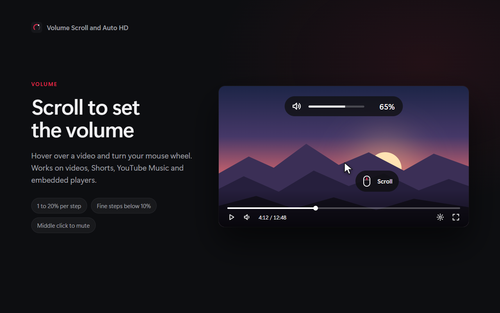
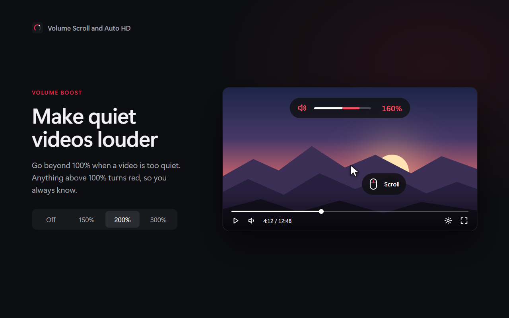
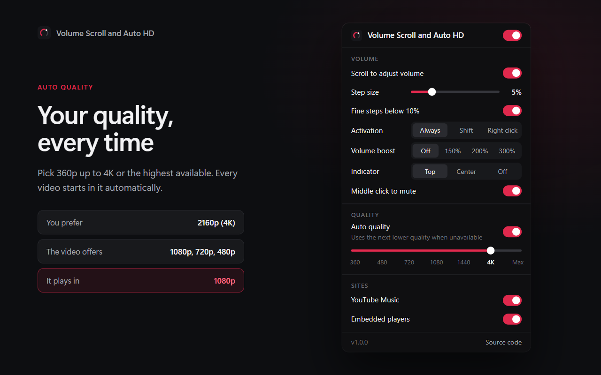

# Volume Scroll and Auto HD for YouTube

Control YouTube's volume with your mouse wheel and play every video in your preferred quality automatically.

A lightweight browser extension for Firefox and all Chromium-based browsers, with no dependencies, no build step and no tracking.



## Features

### Volume

- Scroll over a video to change the volume. Works on regular videos, Shorts, the miniplayer, theater and fullscreen mode, YouTube Music and embedded players.
- Adjustable step size from 1% to 20%.
- Fine steps: below 10% the volume changes in 1% increments.
- Optional activation: always, while holding Shift, or while holding the right mouse button.
- Volume boost up to 150%, 200% or 300% for quiet videos. Levels above 100% are highlighted in red.
- A minimal on-screen indicator at the top or center of the player, or none at all.
- Middle click on the player to mute or unmute.
- The volume is saved the same way YouTube saves it, so it carries over to the next page load.

### Quality

- Choose a preferred quality: 360p, 480p, 720p, 1080p, 1440p, 2160p (4K) or the highest available.
- If a video doesn't offer your preferred quality, the next lower one is used.
- Applies to every new video, including Shorts and autoplay, and waits until ads have finished.

### Shorts

Scrolling over the video changes the volume. Scrolling beside it moves to the next Short as usual.




## Installation

Download the latest ZIP from the [releases page](https://github.com/init201/volume-scroll-and-auto-hd/releases) or clone this repository.

### Firefox

1. Open `about:debugging#/runtime/this-firefox`.
2. Click **Load Temporary Add-on** and select the ZIP or `manifest.json`.

Temporary add-ons are removed when Firefox restarts. For a permanent installation, use the signed version from addons.mozilla.org. Requires Firefox 140 or later.

### Chrome, Edge, Brave, Opera, Vivaldi

1. Unzip the download.
2. Open `chrome://extensions` (or `edge://extensions`, `brave://extensions`).
3. Turn on **Developer mode**.
4. Click **Load unpacked** and select the unzipped folder or the repository folder.

Requires a Chromium-based browser, version 111 or later.

## How it works

| File | Purpose |
| --- | --- |
| `src/player.js` | Runs in the page context and uses YouTube's own player API (`setVolume`, `setPlaybackQualityRange`), so YouTube's volume slider and quality menu stay in sync. |
| `src/bridge.js` | Reads settings from `storage.sync` and forwards them to the page script. |
| `src/defaults.js` | Default settings shared by the popup and the bridge. |
| `src/popup/` | The settings popup. |

Volume boost routes the video's audio through a Web Audio gain node inside your browser. No audio or data ever leaves your device.

## Permissions and privacy

| Permission | Why |
| --- | --- |
| `storage` | Saves your settings and syncs them across your devices when Firefox Sync or Chrome Sync is on. |
| `youtube.com`, `music.youtube.com`, `youtube-nocookie.com` | Required to control the video player on these sites. |

No analytics, no tracking, no network requests and no remote code. See the full [privacy policy](PRIVACY.md).

## Project structure

```
manifest.json         Extension manifest for Firefox and Chromium
icons/                Extension icons
src/                  Extension source
  bridge.js
  defaults.js
  player.js
  popup/
scripts/              Development and release scripts
store/                Store listing texts and screenshot templates
docs/                 Images for this README
```

Only `manifest.json`, `icons/`, `src/` and `LICENSE` end up in the published package.

## Development

The extension itself has no dependencies and no build step. The development commands below need [Node.js](https://nodejs.org) 18 or later.

| Command | What it does |
| --- | --- |
| `npm run check` | Loads the extension in every installed browser (Chrome, Edge, Firefox) and fails on any manifest warning or error. |
| `npm run check -- firefox` | The same, limited to the browsers you name. |
| `npm run lint` | Runs Mozilla's add-on linter, the same one used by addons.mozilla.org. |
| `npm test` | Runs `lint` and `check`. |
| `npm run build` | Creates the ZIP for addons.mozilla.org and the Chrome Web Store in `web-ext-artifacts/`. |
| `npm run release` | Runs all checks, then creates a `v<version>/` folder with the ZIP, store screenshots, promo tile, store icon and listing texts. |
| `npm run start:firefox` | Starts Firefox with the extension loaded and reloads it on every change. |

`npm run check` finds browsers in their default install locations. Set `CHROME_PATH`, `EDGE_PATH` or `FIREFOX_PATH` to use another installation. Each browser runs headless and muted with a temporary profile that is deleted afterwards, so your own profiles are never touched.

## Contributing

Issues and pull requests are welcome. Edit the files, reload the extension and refresh YouTube. Please run `npm test` before opening a pull request.

## License

[MIT](LICENSE)

## Disclaimer

This project is not affiliated with, endorsed by or sponsored by YouTube or Google LLC. YouTube is a trademark of Google LLC.
